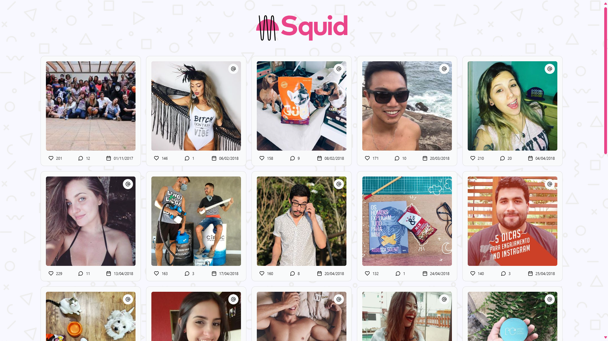

# Wake Creators (AKA Squid It) Front End Challenge

  

## Sumário
- [Proposta](#proposta)
- [Tecnologias usadas](#tecnologias-usadas)
- [Resultado](#resultado-esperado-vs-resultado-entregue)
- [Instalação](#installation)
- [Uso](#uso)

## Proposta

Crie uma página HTML e use JavaScript para obter dados do JSON da requisição GET: `https://us-central1-squid-apis.cloudfunctions.net/test-front-basic`, listando o feed do Instagram da @squidapp. 
Utilize CSS para personalizar o layout conforme a imagem fornecida, incluindo efeitos de hover para todas as imagens.
Cada imagem deve ter um link que abre no Instagram em uma nova aba ao ser clicada. 
Garanta a responsividade e uma boa experiência de usuário, incluindo loaders, tratamento de erros, animações e outros efeitos.

### Resultado Esperado VS Resultado Entregue

#### A demonstração pode ser vista aqui: https://haghalaz.github.io/squid-front-end-challenge/

## Tecnologias usadas
- React: Uma biblioteca JavaScript para construir interfaces de usuário.
- Vite: Uma ferramenta de build rápida que utiliza esbuild para desenvolvimento ágil e builds de produção otimizados.
- Tailwind CSS: Um framework CSS utilitário para construir designs personalizados de forma rápida.
- Biome: Uma ferramenta de linting, formatação e análise de código para manter a qualidade e a consistência do código.
- SWR: React hook para busca de dados. Ele retorna dados do cache (stale), envia uma solicitação de fetch (revalidate) e retorna os dados atualizados.

## Padrões de projetos
- Atomic Design: Uma metodologia para criar sistemas de design consistentes e escaláveis, dividindo a interface do usuário em componentes atômicos, moleculares, organizacionais, de páginas e de templates.
- Singleton: Um padrão de design que garante que uma classe tenha apenas uma instância e fornece um ponto global de acesso a ela.

## Installation
1. Clone o repositório: ``git clone https://github.com/Haghalaz/squid-front-end-challenge.git``
2. Navegue até o diretório do projeto: ``cd squid-front-end-challenge``
3. Instale as dependências: ``npm install``
4. Inicie o servidor de desenvolvimento: ``npm run dev``
5. Abra seu navegador e vá para ``http://localhost:5173/``

## Uso
Sinta-se à vontade para explorar as fotos e links. Se tiver alguma dúvida ou feedback, não hesite em entrar em contato através dos detalhes fornecidos.
